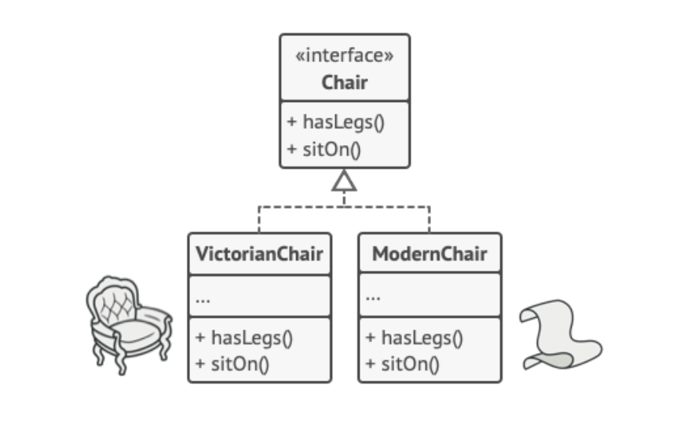
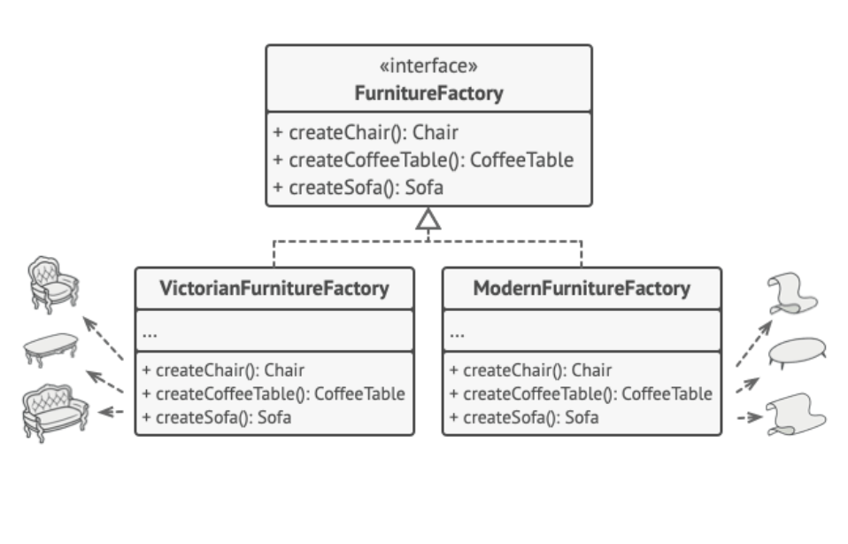
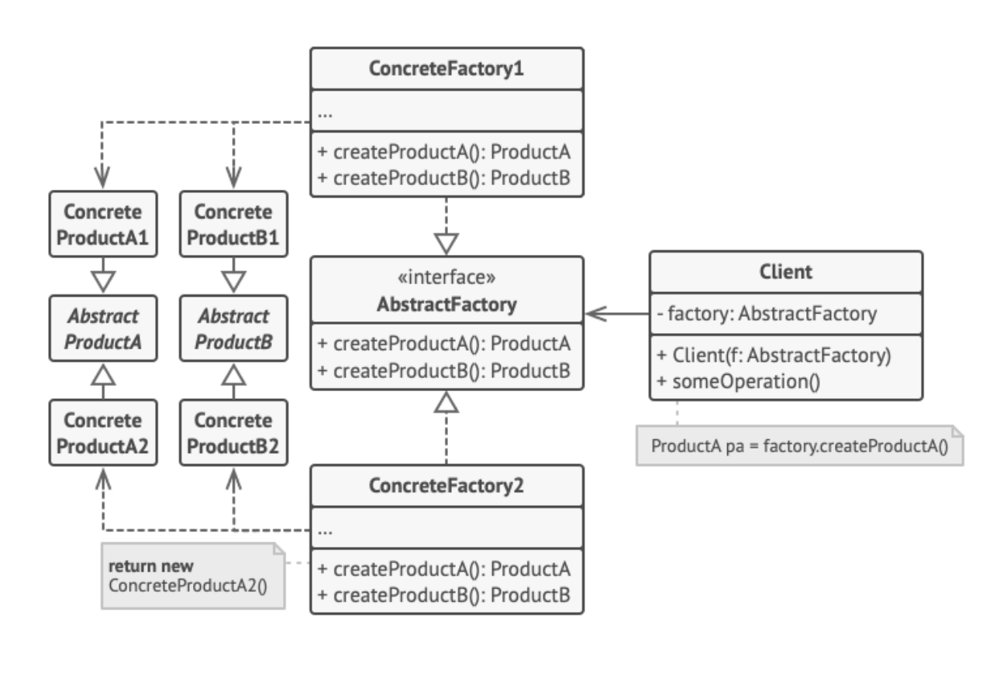

Imagine you're building a furniture shop simulator, and your client is your girlfriend. She loves to change
styles like Modern, Victorian, and Art Deco, and she wants the flexibility to add or remove styles whenever she 
feels like it. You need a way to ensure her selections always match without rewriting your code every time she 
changes her mind.

The Abstract Factory pattern is like having a magical furniture catalog that always gives matching sets. 
Here’s how it works:

    1. Define Product Interfaces: Create interfaces for each type of product.
    
        Chair Interface: All chair variants implement this interface.
        Sofa Interface: All sofa variants implement this interface.
        CoffeeTable Interface: All coffee table variants implement this interface.

    2.Abstract Factory Interface: Declare an interface with methods to create each type of product.
        
        Methods like createChair, createSofa, and createCoffeeTable return abstract product types.

    3. Concrete Factories: For each product variant, create a factory class that implements the Abstract Factory interface.

        ModernFurnitureFactory: Creates ModernChair, ModernSofa, and ModernCoffeeTable.
        VictorianFurnitureFactory: Creates VictorianChair, VictorianSofa, and VictorianCoffeeTable.

The client code interacts with factories and products through their abstract interfaces. This means my
girlfriend can choose a style, and everything she gets will match perfectly. If she suddenly decides 
she wants all Art Deco furniture, she can switch without any hassle.

The application selects and creates a concrete factory object at the initialization stage based on 
configuration or environment settings. This setup ensures that all products created by a factory match 
in style.

Adding this abstraction will allow for consistency, ensures matching furniture styles.
It follows the O in the SOLID principles, because it allows us to easily add or
remove product families or variants without changing existing code.
And it keeps our client happy because the client code interacts with abstract interfaces,
making it easy to switch styles without the client having to make any changes on their end. 

The Abstract Factory pattern is a game-changer, making it easy to keep my girlfriend happy with matching
furniture, no matter how often she changes her mind about styles.

Best, 

Merl
